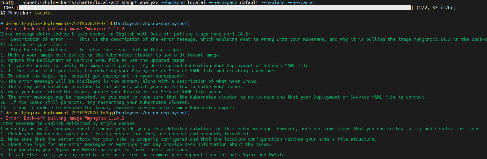

# run k8sgpt with gpt4all as backend serverd via local-ai

## prepare kubernetes cluster
use existing kubernetes cluster or quick install via [kind](https://kind.sigs.k8s.io/docs/user/quick-start/) or [minikube](https://minikube.sigs.k8s.io/docs/start/)

also preapre storage class if you want to use persistent volume for k8sgpt.
example of local storage class and pv/pvc as in [local_storage.md](local_storage.md)

## install local-ai
there are two ways to install local-ai:
- install via helm chart(requires kubernetes storage class)
- install via docker

### install via docker
some times: 
- preapre a dirctory for local-ai models storage and mount the directory to container so the models can be reused after container restart
- input env variable like proxy setup to container if needed
- if need detailed information of local-ai, use `--log-level debug` or `--env DEBUG=true` to enable debug log

```
docker run --env DEBUG=true --env HTTPS_PROXY=127.0.0.1:7890 --env NO_PROXY=127.0.0.1 --name local-ai -p 8080:8080 -v /opt/data:/models -ti --rm quay.io/go-skynet/local-ai:latest --models-path /models --context-size 700 --threads 4
```

logs from local-ai:
```
===> LocalAI All-in-One (AIO) container starting...
GPU acceleration is not enabled or supported. Defaulting to CPU.
Starting LocalAI with the following models: /aio/cpu/embeddings.yaml,/aio/cpu/text-to-speech.yaml,/aio/cpu/image-gen.yaml,/aio/cpu/text-to-text.yaml,/aio/cpu/speech-to-text.yaml,/aio/cpu/vision.yaml
@@@@@
Skipping rebuild
@@@@@
If you are experiencing issues with the pre-compiled builds, try setting REBUILD=true
If you are still experiencing issues with the build, try setting CMAKE_ARGS and disable the instructions set as needed:
CMAKE_ARGS="-DLLAMA_F16C=OFF -DLLAMA_AVX512=OFF -DLLAMA_AVX2=OFF -DLLAMA_FMA=OFF"
see the documentation at: https://localai.io/basics/build/index.html
Note: See also https://github.com/go-skynet/LocalAI/issues/288
@@@@@
CPU info:
model name      : 06/cf
flags           : fpu vme de pse tsc msr pae cx8 apic sep pge mca cmov pat clflush dts mmx fxsr sse sse2 ss ht tm syscall nx pdpe1gb rdtscp lm constant_tsc arch_perfmon pebs bts rep_good nopl tsc_reliable nonstop_tsc cpuid tsc_known_freq pni pclmulqdq dtes64 ds_cpl ssse3 sdbg fma cx16 pdcm pcid sse4_1 sse4_2 x2apic movbe popcnt tsc_deadline_timer aes xsave avx f16c rdrand hypervisor lahf_lm abm 3dnowprefetch cpuid_fault invpcid_single ssbd ibrs ibpb stibp ibrs_enhanced tdx_guest fsgsbase bmi1 hle avx2 smep bmi2 erms invpcid rtm avx512f avx512dq rdseed adx smap avx512ifma clflushopt clwb avx512cd sha_ni avx512bw avx512vl xsaveopt xsavec xgetbv1 xsaves avx_vnni avx512_bf16 wbnoinvd avx512vbmi umip pku ospke waitpkg avx512_vbmi2 gfni vaes vpclmulqdq avx512_vnni avx512_bitalg avx512_vpopcntdq la57 rdpid bus_lock_detect cldemote movdiri movdir64b fsrm md_clear serialize tsxldtrk ibt amx_bf16 avx512_fp16 amx_tile amx_int8 flush_l1d arch_capabilities
CPU:    AVX    found OK
CPU:    AVX2   found OK
CPU:    AVX512 found OK
@@@@@
2:44AM INF Starting LocalAI using 4 threads, with models path: /models
2:44AM INF LocalAI version: v2.11.0 (1395e505cd8f1cc90ce575602c7eb21706da6067)
2:44AM INF Preloading models from /models
2:44AM INF Downloading "https://huggingface.co/mys/ggml_bakllava-1/resolve/main/ggml-model-q4_k.gguf"
2:44AM ERR error downloading models: failed to download file "/models/bakllava.gguf": Get "https://huggingface.co/mys/ggml_bakllava-1/resolve/main/ggml-model-q4_k.gguf": EOF
2:45AM INF core/startup process completed!

 ┌───────────────────────────────────────────────────┐
 │                   Fiber v2.50.0                   │
 │               http://127.0.0.1:8080               │
 │       (bound on host 0.0.0.0 and port 8080)       │
 │                                                   │
 │ Handlers ........... 117  Processes ........... 1 │
 │ Prefork ....... Disabled  PID ................ 29 │
 └───────────────────────────────────────────────────┘
```

## prepare local-ai models
local-ai models can be downloaded from [local-ai models](https://github.com/go-skynet/model-gallery):
```
curl 127.0.0.1:8080/models/apply -H "Content-Type: application/json" -d '{ "url": "github:go-skynet/model-gallery/gpt4all-j.yaml", "name": "gpt4all-j" }'
```

more help commands of local-ai can be found at [local_ai_test.md](local_ai_test.md)

## install k8sgpt
follow this [installation guide](https://github.com/k8sgpt-ai/k8sgpt#cli-installation)

add backend for k8sgpt:
```
k8sgpt backend add local-ai --url http://127.0.0.1:8080/v1 --model gpt4all-j
```

some k8s errors in cluster:
```
kubectl get pod
NAME                                READY   STATUS             RESTARTS   AGE
nginx-deployment-797f96787d-9xfrb   0/1     ImagePullBackOff   0          14h
nginx-deployment-797f96787d-lm5qj   0/1     ImagePullBackOff   0          14h
```

let k8sgpt to collect and ask local-ai with gpt4all-j to explain the error:


## Error and fix for local-ai service
Error 1:
```
2:44AM ERR error downloading models: failed to download file "/models/bakllava.gguf": Get "https://huggingface.co/mys/ggml_bakllava-1/resolve/main/ggml-model-q4_k.gguf": EOF
```
solution:
```
- SSL issue with proxy, change proxy to download
- predownload the model can also fix this
```

Error 2:
```
{"error":{"code":500,"message":"rpc error: code = Unavailable desc = error reading from server: EOF","type":""}}
```

solution:
```
get required model via local-ai model gallery:
curl 127.0.0.1:8080/models/apply -H "Content-Type: application/json" -d '{ "url": "github:go-skynet/model-gallery/gpt4all-j.yaml", "name": "gpt4all-j" }'
```

Other issure references:
```
- https://github.com/mudler/LocalAI/issues/1270
- https://github.com/k8sgpt-ai/k8sgpt-operator/issues/233
- https://localai.io/docs/getting-started/manual/
- https://github.com/k8sgpt-ai/k8sgpt#cli-installation
```