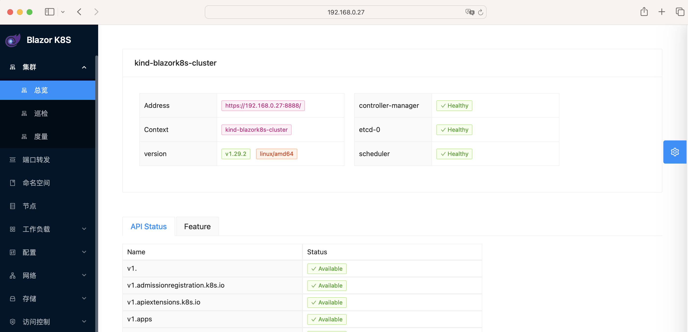
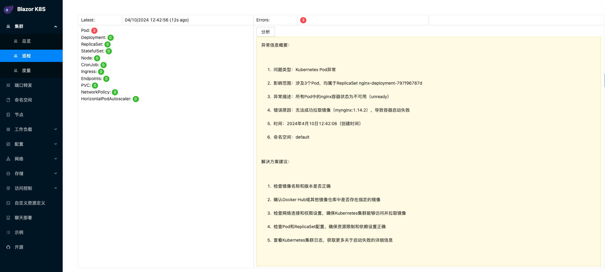
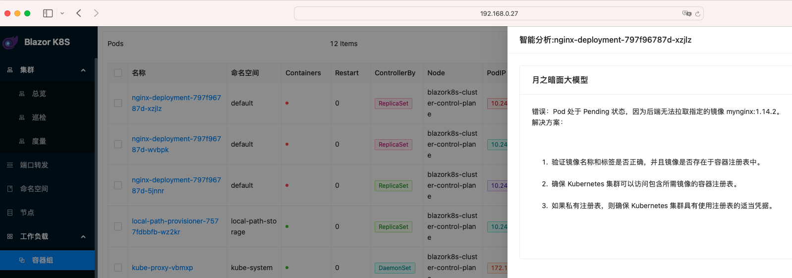
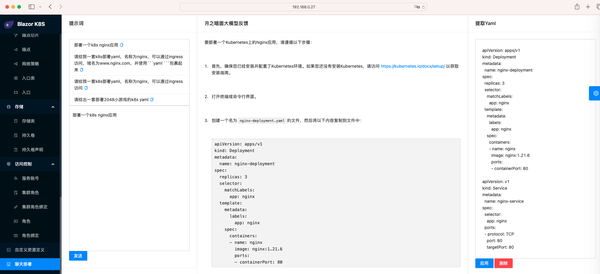
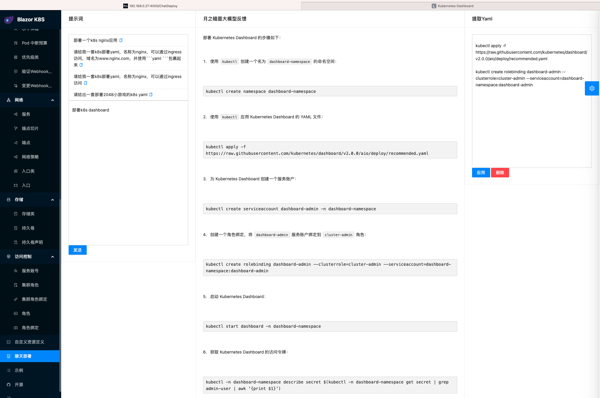

# 1. blazork8s Introduction
[blazork8s](https://github.com/weibaohui/blazork8s) is a Kubernetes management tool integrating the large language models like OpenAI, MoonShot AI,  Ali Qwen, Google Gemini, XunFeiAI etc.

# 2. build a k8s cluster via kind
the kind config file kind-blazorK8s.yaml
```
kind: Cluster
apiVersion: kind.x-k8s.io/v1alpha4
nodes:
- role: control-plane
  extraPortMappings:
  - containerPort: 6443
    hostPort: 6443
```

Some tips:
- make sure k8s api server port is mapped out
- for other container in same host to access the API server, map host's 6443 port to port 8888(any valid port will do)
```
brew install socat
sudo socat TCP4-LISTEN:8888,fork TCP4:192.168.0.27:6443          
```

# 3. use docker to run blazork8s
## 3.1 update config file appsettings.json to use MoonShot AI
```
...
  "AI": {
    "Enable": true,
    "Select": "MoonShotAI"
  },
...
  "MoonShotAI": {
    "Token": "sk-xxxxxxxxxxxxxxxxxxxxxxxxxxxx",
    "Model": "moonshot-v1-8k",
    "BaseUrl": "https://api.moonshot.cn/v1",
    "Prompt": {
      "error": "请你用Kubernetes专家的身份判断简化以下Kubernetes错误信息，并以不超过300个字符的分步方式提供最可能的解决方案。按以下格式编写输出：错误：{在此处解释错误}     解决方案：{在此处填写分步解决>方案}",
      "security": "请你用Kubernetes专家的身份判断简化以下Kubernetes安全方面的信息，并以不超过300个字符的分步方式提供最可能的安全解决方案。按以下格式编写输出：问题：{在此处解释安全问题}     解决方案：{在
此处填写分步解决方案}"
    }
  },
...
```

## 3.2 rebuild blazork8s image to use this config file with bellow Dockerfile
```
FROM ghcr.io/weibaohui/blazork8s:0.1.6
ADD appsettings.json /app
ENTRYPOINT ["./BlazorApp"]
```

## 3.3 prepare kubeconfig
update the server address to host IP with port 8888
```
apiVersion: v1
clusters:
- cluster:
    certificate-authority-data: LS0mmmm...
    server: https://192.168.0.27:8888
  name: kind-blazork8s-cluster
contexts:
- context:
    cluster: kubernetes
    user: kubernetes-admin
  name: kubernetes-admin@kubernetes
- context:
    cluster: kind-blazork8s-cluster
    user: kind-blazork8s-cluster
  name: kind-blazork8s-cluster
current-context: kind-blazork8s-cluster
kind: Config
preferences: {}
users:
- name: kubernetes-admin
  user:
    client-certificate-data: LS0aaaa...
    client-key-data: LS0zzzz...
- name: kind-blazork8s-cluster
  user:
    client-certificate-data: LS0yyyy...
    client-key-data: LS0xxxx...
```

## 3.4 run blazork8s
commands to start the container with mounted kubeconfig:
```
docker run -it --rm  -v ./kube/:/root/.kube/ -p 4000:8080 blazork8s:v1
```

# 4. try out blazork8s UI
## 4.1 open blazork8s UI via http://$HOST_IP:4000/
the UI


## 4.2 deploy a deployment of 3 replica of Nginx with wrong image name
nginx_wrong.yaml
```
apiVersion: apps/v1
kind: Deployment
metadata:
  name: nginx-deployment
  labels:
    app: nginx
spec:
  replicas: 3
  selector:
    matchLabels:
      app: nginx
  template:
    metadata:
      labels:
        app: nginx
    spec:
      containers:
      - name: nginx
        image: mynginx:1.14.2
        ports:
```

the error message:
```
kubectl get pod
NAME                                READY   STATUS             RESTARTS   AGE
nginx-deployment-797f96787d-5jnnr   0/1     ImagePullBackOff   0          10h
nginx-deployment-797f96787d-wvbpk   0/1     ImagePullBackOff   0          10h
nginx-deployment-797f96787d-xzjlz   0/1     ImagePullBackOff   0          10h
```

## 4.3 try out analyze error via MoonShot AI
在“巡检”中点击“分析”按钮


在“工作负载->容器组->出错的POD”中点击“智能分析”按钮


## 4.4 try out deployment helper via MoonShot AI
点击“聊天部署”按钮，并输入“部署一个k8s nginx应用”


“部署k8s dashboard”

